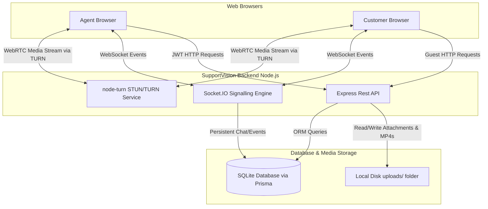

<<<<<<< HEAD
# SupportVision

SupportVision is a production-grade, real-time video support platform designed for low-latency diagnostic sessions. It routes all audio, video, and screen-sharing media directly through an integrated custom STUN/TURN server, ensuring zero peer-to-peer leaks. The platform features user authentication, a live agent dashboard, real-time file sharing, and video session recording.

---

## 🏗️ System Architecture



---

## 🔑 Demo Credentials

- **Role**: Agent Portal
  - **Email**: `agent@demo.com`
  - **Password**: `password123`
  - *(Auto-seeded on server startup)*
- **Role**: Customer / Guest
  - Joins directly using a room link (e.g. `http://localhost:5173/join/<room-id>`)
  - No registration required; enters a guest name to join the call instantly.

---

## ⚙️ Environment Variables

The backend runs using configuration keys from a `.env` file:

```ini
PORT=5000
DATABASE_URL="file:./dev.db"
JWT_SECRET="supportvision_jwt_secret_key_123!"
TURN_PORT=3478
TURN_USER="supportvision"
TURN_PASS="supportvisionpass123!"
FRONTEND_URL="http://localhost:5173"
```

---

## 🚀 Getting Started

Follow these steps to run SupportVision locally on your machine.

### Prerequisites
- **Node.js** v18+ (tested on v24)
- **npm** v9+
- *(Optional)* **FFmpeg** installed and added to your system path. If FFmpeg is present, recordings will convert to `.mp4`. If not, they will save as fully playable `.webm` files.

### Step 1: Install Dependencies
From the repository root directory:

```bash
# Install backend dependencies
cd backend
npm install

# Install frontend dependencies
cd ../frontend
npm install --legacy-peer-deps
```

### Step 2: Initialize SQLite Database
In the `backend` folder, run Prisma migrations to build your local database:

```bash
cd backend
npx prisma db push
```

### Step 3: Run the Servers
Open two terminal windows to launch the backend API and frontend Vite server simultaneously.

**In terminal 1 (Backend Server):**
```bash
cd backend
npm start
```
*You will see logs indicating that the TURN server has started on port 3478 and the Express API is listening on port 5000.*

**In terminal 2 (Frontend Client):**
```bash
cd frontend
npm run dev
```
*The Vite development server will activate on `http://localhost:5173`.*

---

## 🎥 Support Call Walkthrough Demonstration

1. Navigate to `http://localhost:5173/login`.
2. Enter the agent credentials: `agent@demo.com` and `password123`.
3. In the Agent Dashboard, click the **Create Invite Link** button.
4. Copy the generated customer link (e.g., `http://localhost:5173/join/<token>`).
5. Open a new Incognito or separate browser window and navigate to the copied customer link.
6. Enter a name (e.g., "Alice Smith") and click **Join Call as Guest**.
7. Both screens will load their cameras and establish a secure relayed WebRTC call connection.
8. Use the control bar to mute microphone, toggle camera, share screens, or send diagnostic files in the chat drawer.
9. As the Agent, click the **Record** button to archive the shared audio and video feed. Click **Stop** to process and save the file.
10. End the call. Go to the **Call History** tab in the Agent Dashboard to view the participant list, chat transcripts, and download the call recording.
=======
# SupportVision
>>>>>>> d2bc1c836b645d051fb75e0e1a561259297c843e
